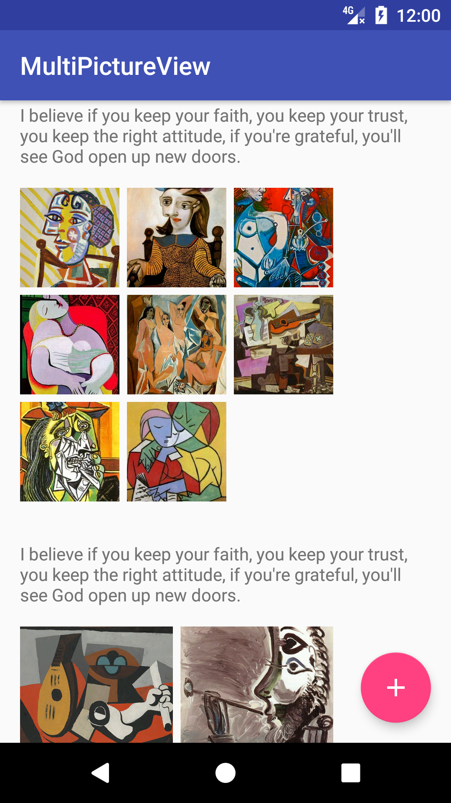
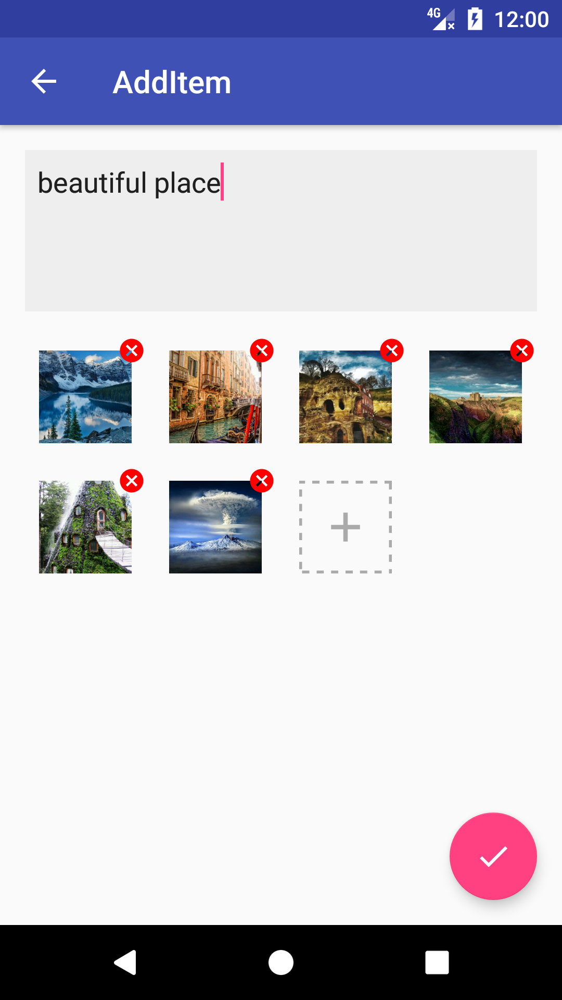

# MultiPictureView


[  ](https://bintray.com/goyourfly/maven/MultiPictureView/_latestVersion)


##### MultiPictureView是一个可以将多张图片以网格的方式显示的View，通过简单的接口实现烦人的布局，从此解放你的小手手

### Demo

<table>
<tr>
<td>

</td>
<td>

</td>
</tr>
</table>

### Usage
> 详细的使用请看示例代码

##### 1. 在布局中声明
````xml
<com.goyourfly.multi_picture.MultiPictureView
	android:id="@+id/multi_image_view"
	android:layout_width="match_parent"
	android:layout_height="wrap_content"
	app:editable="false"
	app:deleteDrawable="@drawable/..."
	app:addDrawable="@drawable/..."
	app:imageLayoutMode="DYNAMIC"
	app:max="9"
	app:ratio="1"
	app:space="6dp"
	app:span="3" />
````

|  参数  |  类型  |  说明  |  默认值  |
|----|----|----|----|
| editable| boolean | 是否可编辑（添加和删除）| false |
|  span | integer | 每行最多显示多少 | 3 |
|  ratio | float | 宽高比例 | 1 |
| space | dimension | 图片间隔大小  | 8dp |
| max | integer | 最多显示多少张图片 | 9 |
| imageLayoutMode | integer | 图片布局类型：动态(DYNAMIC=1)和静态(STATIC=2) | STATIC=2 |
| deleteDrawable | drawable | 删除图标 | 红色删除Drawable |
| addDrawable | drawable | 添加图片 | 灰色添加图片Drawable |

##### 2. 在代码中使用
###### 2.1 初始化ImageLoader
````kotlin
MultiPictureView.setImageLoader(object : ImageLoader {
    override fun loadImage(image: ImageView, uri: Uri) {
        Vincent.with(image.context)
                .load(uri)
                .placeholder(R.drawable.ic_placeholder_loading)
                .error(R.drawable.ic_placeholder_loading)
                .into(image)
    }
})
````

###### 2.2 绑定图片资源，设置事件监听
```` java
multiPictureView = (MultiPictureView) findViewById(R.id.multi_image_view);
// 设置图片资源
multiPictureView.setList(list:List<Uri>)
multiPictureView.setAddClickCallback(new MultiPictureView.AddClickCallback() {
    @Override
    public void onAddClick(View view) {
		...
    }
});
multiPictureView.setDeleteClickCallback(new MultiPictureView.DeleteClickCallback() {
    @Override
    public void onDeleted(View view,int index) {
		...
    }
});
multiPictureView.setItemClickCallback(new MultiPictureView.ItemClickCallback() {
    @Override
    public void onItemClicked(View view,int index,ArrayList<Uri> uris) {
		...
    }
});
````

### Compile

[  ](https://bintray.com/goyourfly/maven/MultiPictureView/_latestVersion)

````
dependencies {
    compile 'com.github.goyourfly:multi_picture_view:latestVersion'
}
````


### Thanks

- [Matisse](https://github.com/zhihu/Matisse)
- [Vincent](https://github.com/goyourfly/Vincent)
